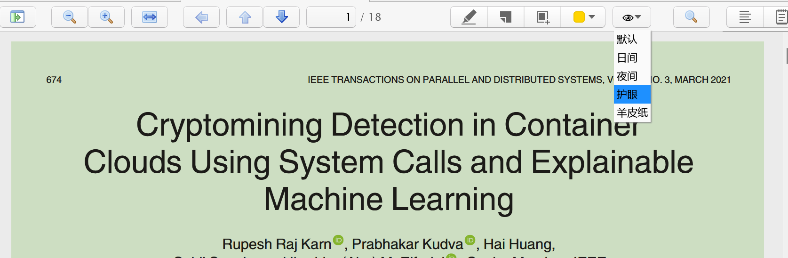
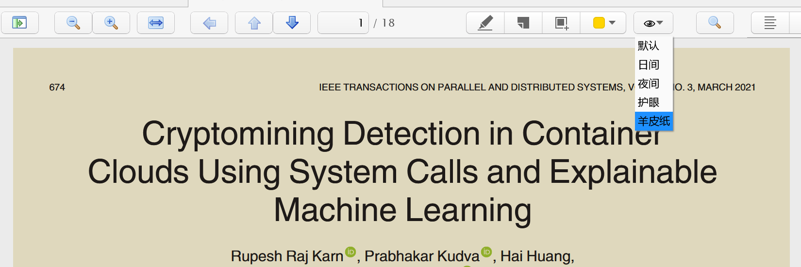
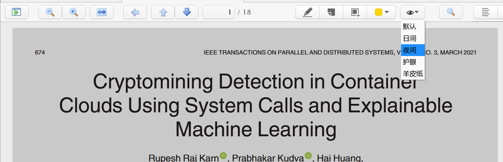

# Zotero PDF Background Plugin

Install by downloading the [latest version](https://github.com/q77190858/zotero-pdf-background/releases/latest)

## Feature

* a multi pdf background to care your eyes
* a button like a eye on the middle toolbar to switch different background mode

## Todo

* add DIY background color function(Maybe)

## Install

- Download zotero-pdf-backgroundv0.0.2.zip
- Open Zotero->tools->plugins->click setting icon on right top->Install Addon from file...
- Select zotero-pdf-backgroundv0.0.2.zip file
- Restart Zotero

## Build Development Environment

follow these steps to build a zotero debug environment

- [ ] Download Firefox 60 (I use a portable edition)
- [ ] Git clone
- [ ] Download and launch [zotero dev edition](https://www.zotero.org/support/dev_builds) with --debugger
- [ ] Launch Firefox 60
- [ ] In Firefox, go to devtools, go to settings, click *'Enable browser chrome and add-on debugging toolboxes'* and *'Enable remote debugging'*.
- [ ] In Zotero, go to setting, advanced, config editor, look up "devtools" and set true on "devtools.debugger.remote-enabled" and set "devtools.debugger.remote-port" 6100
- [ ] In Firefox, click the hamburger menu in the top right -> web developer -> Connect...
- [ ] Enter localhost:6100
- [ ] Connect
- [ ] Click "Inspect Main Process"

## Thanks
This plugin's framework is based on [zotero-night](https://github.com/tefkah/zotero-night)