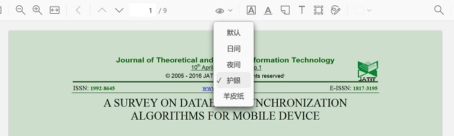
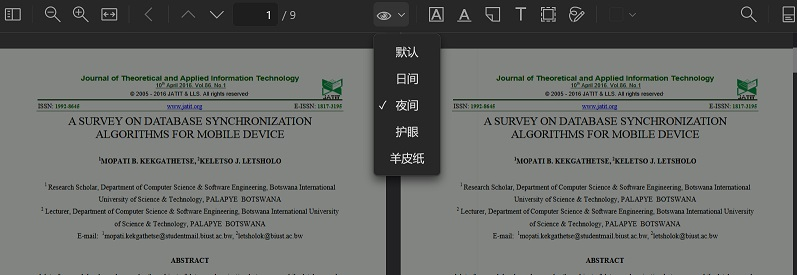

# Zotero PDF Background Plugin

Install by downloading the [latest version](https://github.com/q77190858/zotero-pdf-background/releases/latest)

## Feature

* **Now Support Zotero7!**
* **Adapted to System Dark Mode!**
* **Adapted to Split View Mode!**
* **Support DIY background color in Setting!**
* **Support English!**
* add a plugin icon
* a multi pdf background to care your eyes
* a button like a eye on the middle toolbar to switch different background mode

## Todo

* No more(Maybe)

## Install

- Download zotero-pdf-backgroundv2.1.0.xpi
- Open Zotero->tools->plugins->click setting icon on right top->Install Addon from file...
- Select zotero-pdf-backgroundv2.1.0.xpi file
- Restart Zotero

## Build Development Environment

follow these steps to build a zotero debug environment

- [ ] Git clone
- [ ] Download and launch [zotero dev edition](https://www.zotero.org/support/dev_builds) with -ZoteroDebugText -jsdebugger
- [ ] Launch zotero dev edition
- [ ] In zotero dev edition, a independent devtools would be started.
- [ ] A MessageBOX will ask: "An incoming request to permit remote debugging connection was detected. A remote client can take complete control over your browser!" Click "OK" to allow connection.
- [ ] To run plugin from source code, see official [setting_up_a_plugin_development_environment](https://www.zotero.org/support/dev/client_coding/plugin_development#setting_up_a_plugin_development_environment)

## Thanks
This plugin's framework is based on [official sample plugin make-it-red](https://github.com/zotero/make-it-red)